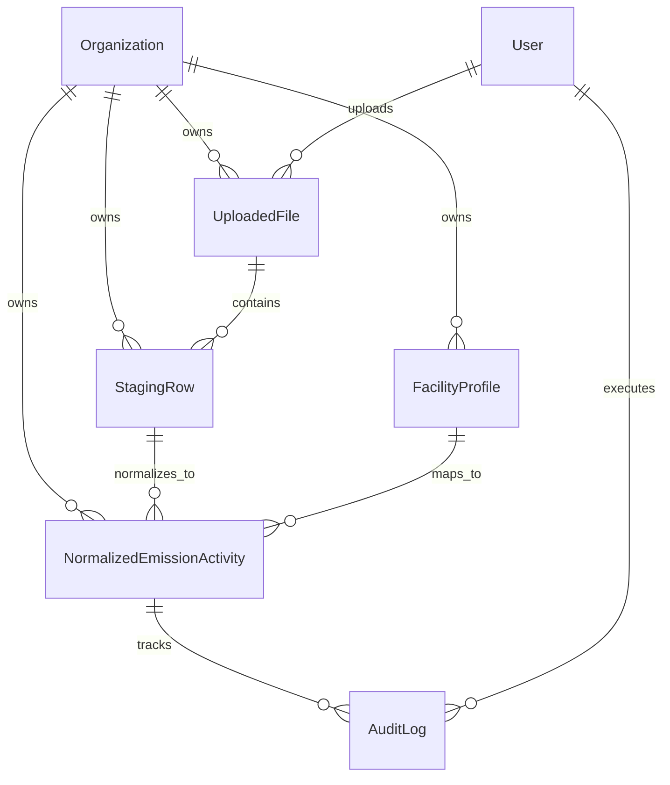

# Data Architecture & Entity Relationship Specification

## 1. Schema Design Philosophy & Technical Guardrails (The "Why" and "How")

I designed this database schema to serve as the high-integrity foundation for corporate greenhouse gas (GHG) accounting. It adheres strictly to the **Greenhouse Gas Protocol Corporate Standard** and **ISO 14064-1** reporting requirements. To satisfy regulatory audits, I structured the database using a clean division between an immutable raw **Staging Layer** and a relational **Canonical Normalization Layer**.

Below is the architectural justification of how and why my data model handles multi-tenancy, scope categorization, source lineage, unit normalization, and audit trails.

---

### A. Multi-Tenant Isolation Strategy
* **The "Why" (Rationale)**: 
  Exposing corporate carbon accounting data across enterprise accounts is a critical security violation. Clients require cryptographic-grade confidence that their utility bills, procurement records, and corporate travel metrics are isolated.
* **The "How" (Implementation)**: 
  I enforce tenant isolation at the schema level by introducing a central `Organization` model as the primary tenant partition. Every transactional entity—`FacilityProfile`, `UploadedFile`, `StagingRow`, and `NormalizedEmissionActivity`—holds a direct, indexed `ForeignKey` reference to `Organization`. In the backend view layers, I intercept all incoming queries to extract the tenant identifier via a custom `X-Tenant-ID` header, forcing the database query planner to restrict lookups to that organization's boundaries.

---

### B. GHG Protocol Scope 1/2/3 Categorization
* **The "Why" (Rationale)**: 
  Regulatory ESG reporting requires emissions to be categorized into distinct Scopes. Scope 1 covers direct emissions (e.g., combusted fuel), Scope 2 covers indirect emissions from purchased electricity, and Scope 3 covers value chain activities (e.g., business travel and lodging). Each scope requires different structural fields (e.g., physical facility locations for Scopes 1 & 2 vs. travel/lodging metrics independent of localized factories for Scope 3).
* **The "How" (Implementation)**: 
  I implemented this by defining explicit choice enums on the `NormalizedEmissionActivity` model:
  - `ghg_scope`: Captures `'Scope 1'`, `'Scope 2'`, or `'Scope 3'`.
  - `activity_type`: Classifies the activity category as `'fuel'`, `'electricity'`, or `'travel'`.
  - **Facility Nullability**: While Scope 1 and Scope 2 records are bound directly to a physical `FacilityProfile` (representing the plant consuming the fuel or electricity), I configured `facility` as nullable (`null=True, blank=True`) to natively support Scope 3 corporate travel bookings, which are location-independent and tied to employee IDs rather than localized manufacturing plants.

---

### C. Source-of-Truth & Lineage Tracking
* **The "Why" (Rationale)**: 
  Sustainability auditors must be able to trace any reported emissions metric back to the raw source data (the exact PDF invoice, CSV upload, or webhook payload). Furthermore, if an analyst manually overrides a value (e.g. correcting a typos-ridden quantity), the database must preserve a historical snapshot of the original ingestion data for comparison.
* **The "How" (Implementation)**: 
  - **Staging Row Linkage**: I configured a `ForeignKey` relationship from `NormalizedEmissionActivity` to `StagingRow` (One-to-Many). This supports billing split scenarios where a single raw utility invoice crossing a month or year boundary is fractionally divided into multiple normalized database rows.
  - **Uploaded File Registry**: Each `StagingRow` points back to an `UploadedFile` (which records the filename, uploader user, and timestamp) or remains null to identify an API JSON webhook payload.
  - **Auditor Snapshot Columns**: I added `original_quantity`, `original_unit`, and `original_cost` fields directly to the `NormalizedEmissionActivity` model. During the model's initial `save()`, my database code freezes a copy of the raw ingested values in these fields. Any subsequent updates by analysts only modify the active `quantity`, `unit`, and `cost` fields, leaving the historical original snapshots un-modified for auditors.

---

### D. Unit Normalization & Precision Protection
* **The "Why" (Rationale)**: 
  Raw data arrives in localized, inconsistent measurements (e.g., fuel in Liters, Gallons, or Metric Tons; electricity in kWh or MWh; travel in miles or kilometers). To apply standard carbon intensity factors, my pipeline must normalize these into canonical metrics (`L`, `kg`, `kWh`, `km`, `room-nights`). Furthermore, utilizing standard float data types introduces binary rounding drift errors during high-frequency database rollups, which is unacceptable for regulatory financial-grade reporting.
* **The "How" (Implementation)**: 
  - **Canonical Normalization**: The ingestion strategies process raw inputs and map them to standard metrics using lookup tables and conversion factors in `utils.py`.
  - **Decimal Fields**: I mapped all quantity, cost, and historical fields to `DecimalField` (using `max_digits=18` and `decimal_places=6` for quantities, and `decimal_places=2` for costs).
  - **Quantization Hooks**: In the model's `save()` method, I write defensive quantization hooks (`Decimal.quantize()`) to clean all numeric values. This ensures that any input values are rounded to standard decimals before validation or storage, preventing binary precision drift.

---

### E. Regulatory Audit Trail Ledger
* **The "Why" (Rationale)**: 
  External ESG auditors must have access to a complete, unalterable trail of manual changes. If an analyst modifies an active emission record, the system must log who made the change, when it occurred, which field was altered, the old value, the new value, and a compliance comment explaining the business justification.
* **The "How" (Implementation)**: 
  - **AuditLog Model**: I designed a dedicated `AuditLog` table linked to `NormalizedEmissionActivity` and the Django `auth.User`. It captures the audit trail metrics, including the `field_modified`, `old_value`, `new_value`, and the analyst's custom `comment`.
  - **Double-Lock Immutability**: I overrode the `save()` and `delete()` methods on both `StagingRow` and `AuditLog` models to raise a `ValidationError` on update/delete attempts, forcing these tables to function as immutable, append-only streams.
  - **Record Locking**: On the `NormalizedEmissionActivity` model, transitioning the status to `'APPROVED'` automatically flags `is_locked = True`. Subsequent API modification or deletion requests on that record are blocked.

---

## 2. Entity Dictionary & Field Specifications

Below are the field-level database parameters I configured for the models in the ingestion system.

### A. Organization (The Multi-Tenant Core)
Serves as the primary tenant partition. All records must link here to enforce strict row-level security.

| Field Name | Data Type | Database Constraints / Indexing | Functional Business Purpose |
| :--- | :--- | :--- | :--- |
| `id` | `AutoField` | Primary Key, Auto-Increment | Unique surrogate identifier for the tenant organization. |
| `name` | `CharField` | Unique, Max Length: 255 | Official corporate entity name used in compliance filings. |
| `slug` | `SlugField` | Unique, Max Length: 255, Indexed | URL-friendly unique identifier representing the organization. |
| `created_at` | `DateTimeField` | `auto_now_add=True` | Records the timestamp when the tenant was provisioned. |

### B. FacilityProfile (ERP Organizational Unit Mapping)
Bridges raw system organizational codes (such as SAP `WERKS` strings) to physical reporting units.

| Field Name | Data Type | Database Constraints / Indexing | Functional Business Purpose |
| :--- | :--- | :--- | :--- |
| `id` | `AutoField` | Primary Key, Auto-Increment | Unique identifier for the facility. |
| `organization` | `ForeignKey` | `on_delete=models.CASCADE` | Identifies the tenant organization that owns this facility. |
| `facility_name` | `CharField` | Max Length: 255 | Standard readable facility name (e.g., "Munich Factory"). |
| `plant_code` | `CharField` | Max Length: 50, Indexed | Raw ERP key code (e.g., SAP plant `WERKS` like `1010` or `DE01`). |
| `location` | `CharField` | Max Length: 255, Nullable | City/Country location details for emission factor localization. |

- **Composite Index**: I enforce a composite unique index `unique_together = ("organization", "plant_code")` at the database level to prevent duplicate ERP code mappings within the same tenant.

### C. UploadedFile (Ingestion Lifecycle Tracking)
Tracks file context for audit trails and data lineage.

| Field Name | Data Type | Database Constraints / Indexing | Functional Business Purpose |
| :--- | :--- | :--- | :--- |
| `id` | `AutoField` | Primary Key, Auto-Increment | Unique identifier for the uploaded file registry. |
| `organization` | `ForeignKey` | `on_delete=models.CASCADE` | Maps the file to the uploading corporate tenant. |
| `source_type` | `CharField` | Max Length: 50, Choices: `sap`, `utility`, `travel` | Identifies the ingestion pipeline schema rules to apply. |
| `original_filename` | `CharField` | Max Length: 255 | Name of the source file (CSV/JSON) uploaded by the analyst. |
| `uploaded_at` | `DateTimeField` | `auto_now_add=True` | Auditor time-stamp of raw data entry. |
| `uploaded_by` | `ForeignKey` | `on_delete=models.SET_NULL`, Nullable | Links to the `auth.User` model of the uploading analyst. |

### D. StagingRow (The Raw Immutable Log)
Saves raw, un-parsed source records in their native format to serve as a verifiable "single source of truth" during audits.

| Field Name | Data Type | Database Constraints / Indexing | Functional Business Purpose |
| :--- | :--- | :--- | :--- |
| `id` | `AutoField` | Primary Key, Auto-Increment | Unique staging row tracker. |
| `organization` | `ForeignKey` | `on_delete=models.CASCADE` | Links the raw log row to its tenant organization. |
| `uploaded_file` | `ForeignKey` | `on_delete=models.CASCADE`, Nullable | Links back to the source file metadata (null for JSON webhooks). |
| `source_type` | `CharField` | Max Length: 50 | Category of the source record (`sap`, `utility`, `travel`). |
| `raw_data` | `JSONField` | No Nulls | Complete, case-sensitive dictionary of the raw input. |
| `is_processed` | `BooleanField` | Default: `False` | Flags if this raw data has been parsed into canonical activities. |
| `created_at` | `DateTimeField` | `auto_now_add=True` | Logging timestamp for ingestion pipeline sequencing. |

- **Immutability rule**: I override model `save` (for updates) and `delete` hooks to raise `ValidationError` to guarantee staging log immutability.

### E. NormalizedEmissionActivity (The Canonical Activity Hub)
The core ledger holding normalized, validated activity records classified by Greenhouse Gas (GHG) Protocol Scope.

| Field Name | Data Type | Database Constraints / Indexing | Functional Business Purpose |
| :--- | :--- | :--- | :--- |
| `id` | `AutoField` | Primary Key, Auto-Increment | Unique canonical ledger key. |
| `organization` | `ForeignKey` | `on_delete=models.CASCADE` | Enforces multi-tenant data boundaries. |
| `staging_row` | `ForeignKey` | `on_delete=models.CASCADE` | Establishes direct lineage back to the raw `StagingRow`. |
| `ghg_scope` | `CharField` | Choices: `Scope 1`, `Scope 2`, `Scope 3` | GHG Protocol Scope categorization. |
| `activity_type` | `CharField` | Max Length: 50 | Category identifier (e.g. `fuel`, `electricity`, `travel`). |
| `facility` | `ForeignKey` | `on_delete=models.SET_NULL`, Nullable | Mapped facility (nullable for travel Scope 3 operations). |
| `start_date` | `DateField` | No Nulls | The start of the physical consumption period. |
| `end_date` | `DateField` | No Nulls | The end of the physical consumption period. |
| `quantity` | `DecimalField` | `max_digits=18`, `decimal_places=6` | Cleaned activity quantity (e.g. liters of fuel, kWh, travel km). |
| `unit` | `CharField` | Max Length: 50 | Normalized target unit of measure (e.g. `L`, `kWh`, `km`). |
| `cost` | `DecimalField` | `max_digits=18`, `decimal_places=2`, Nullable | Total cost associated with the activity transaction. |
| `currency` | `CharField` | Max Length: 10, Default: `EUR` | ISO currency code. |
| `status` | `CharField` | Choices: `PENDING_REVIEW`, `APPROVED`, `REJECTED`, `FLAGGED` | Workflow status for analyst oversight. |
| `validation_issues` | `JSONField` | Default: `list` | Lists warning strings (e.g. "Missing start date, inferred..."). |
| `is_locked` | `BooleanField` | Default: `False` | If True, blocks all modifications by standard users. |
| `original_quantity` | `DecimalField` | `max_digits=18`, `decimal_places=6`, Nullable | **Auditor snapshot**: Original quantity at ingestion time. |
| `original_unit` | `CharField` | Max Length: 50, Nullable | **Auditor snapshot**: Original unit at ingestion time. |
| `original_cost` | `DecimalField` | `max_digits=18`, `decimal_places=2`, Nullable | **Auditor snapshot**: Original cost at ingestion time. |
| `activity_metadata` | `JSONField` | Default: `dict` | Key-value store for context (cabin class, carrier, provider, etc). |

- **Constraints**: I override the model `save()` lifecycle hook to:
  1. Freeze snapshots (`original_*` fields) at creation automatically.
  2. Quantize all Decimals (`quantity` to 6 decimals, `cost` to 2 decimals) to prevent rounding validation issues.
  3. Set `is_locked = True` when status is updated to `APPROVED`.
  4. Raise `ValidationError` if updating/deleting when `is_locked` is already `True`.

### F. AuditLog (The Append-Only Regulatory Ledger)
Logs every manual analyst edit, approval, or rejection to satisfy auditing and traceability requirements.

| Field Name | Data Type | Database Constraints / Indexing | Functional Business Purpose |
| :--- | :--- | :--- | :--- |
| `id` | `AutoField` | Primary Key, Auto-Increment | Unique identifier for the audit event. |
| `activity` | `ForeignKey` | `on_delete=models.CASCADE` | References the related normalized emission activity. |
| `user` | `ForeignKey` | `on_delete=models.SET_NULL`, Nullable | The user who performed the action. |
| `action` | `CharField` | Max Length: 100 | Action taken: `UPLOAD`, `EDIT`, `APPROVED`, `REJECTED`. |
| `field_modified` | `CharField` | Max Length: 100, Nullable | The name of the modified model field (e.g. `quantity`). |
| `old_value` | `TextField` | Nullable | Field value before the manual override. |
| `new_value` | `TextField` | Nullable | Field value after the manual override. |
| `comment` | `TextField` | Nullable | User's explanation or business case justification. |
| `timestamp` | `DateTimeField` | `auto_now_add=True` | Instantaneous UTC timestamp of when the action occurred. |

- **Immutability rule**: I override model `save` (for updates) and `delete` hooks to raise `ValidationError` to guarantee an unalterable audit trail.

---

## 3. Schema Architecture Diagram

